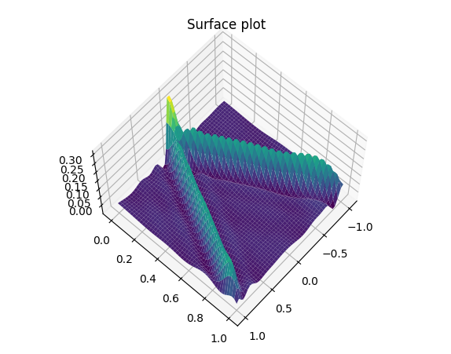

# DGM Keras #
## Implementation ##
This is my implementation of DGM: A deep learning algorithm for solving partial differential equations. I implemented a solver for the wave equation using DGM.

## Results ##
Here is the solution for a 1d wave with c=1 and a rect as initial condition. The code also solves a 2D version of this problem. 

The file wave_pde are the weights of the 2D version of the problem if you want to try it out!

